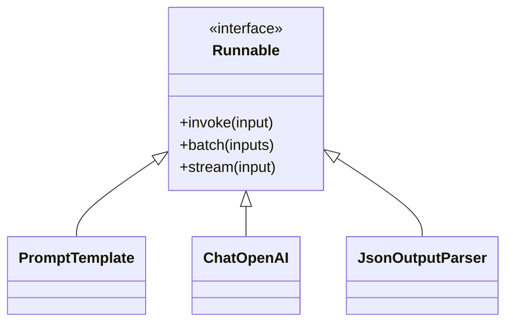

# 簡介 LangChain Expression Language (LCEL)

- LLM 的應用程式通常需要串接多個步驟來完成一個任務
  - 例如，建立樣版、填入樣版、詢問 LLM、解析輸出
- LCEL 使用宣告式的方式串接可執行的步驟，使得程式碼更具可讀性與可維護性。
- LCEL 的設計理念是讓使用者能夠專注於任務的邏輯，而不是實作細節
- 此外，LCEL 也支援平行執行(parallel execution), 能夠容易地撰寫需要平行處理的複雜邏輯。

## 非 LCEL 寫法

中文翻譯英文的 LLM 應用程式

輸入中文, LLM 產生英文翻譯, 然後將翻譯結果印出來

應用程式需要有三個可執行的步驟: 提示詞樣版(prompt template), 對話模型(chat model), 輸出解析器(output parser)

```python
from langchain_core.prompts import PromptTemplate
# Create the prompt template
template_str = """
你是一位翻譯專家, 負責將中文翻譯成英文。
你會先將中文順過一次使其流暢，再翻譯成英文。
輸出 JSON 格式的結果, 包含以下三個欄位:
- `input`: 原始的中文
- `revised_input`: 修正過的中文
- `translation`: 翻譯後的英文

<中文>: {input}
"""

# Creat the template object
chat_template = PromptTemplate.from_template(template_str)
```

建立 chat model 及 輸出解析器

```python
# Create a chat model
# Prerequest: install langchain-openai package
from langchain.chat_models import init_chat_model

chat_model = init_chat_model("gpt-3.5-turbo", model_provider="openai")

# Create a JSON parser
from langchain_core.output_parsers import JsonOutputParser

json_parser = JsonOutputParser() # return a JSON object
```

組裝 提示詞樣版, chat model, 輸出解析器

```python
from langchain_core.prompt_values import PromptValue

# Assemble the three components
# They all support the invoke() method

chinese_str = "美國總統特朗普重返白宮屆滿100天，美國的外交、內政以至金融市場都經歷動盪."
prompt:PromptValue = chat_template.invoke({"input": chinese_str})
response = chat_model.invoke(prompt)
json_result = json_parser.invoke(response)

print(json_result)
```


## LCEL 寫法

```python
# Create the chain
translate_chain = chat_template | chat_model | json_parser

# run the chain
# 因為 chain 中的每個執行步驟都支援 invoke() 方法, 所以可以直接使用 chain.invoke() 方法來執行整個 chain.
# 這樣的寫法會比原本的寫法更簡潔, 而且更容易維護.
translated_result_json = translate_chain.invoke({"input": chinese_str})
```

## Runnable 物件概念

- `Runnable` 代表一個可執行工作
- LCEL 串接多個 `Runnable` 物件, 形成一個串鏈(chain),  以表示一個工作流程(workflow)。
- 第一個 Runnable 物件的輸出會是第二個 Runnable 物件的輸入，以此類推。

## Runnable class 

- `[Runnable](https://python.langchain.com/api_reference/core/runnables/langchain_core.runnables.base.Runnable.html#langchain_core.runnables.base.Runnable)` 類別屬於 `langchain_core.runnables.base` 模組
- 主要方法:
  - `invoke`: 轉換單一輸入為單一輸出(單一執行)
  - `batch`: 轉換多個輸入為多個輸出(批次執行)
  - `stream`: 從單一輪入中串流輸出結果(串流執行)
- 上述這些方法皆有提供非同步(asynchronous)的版本

## Runnable class 的子類別(衍生類別)

- `Runnable` 類別扮演型執行工作的標準操作介面(interface)
- 只要有繼承 `Runnable` 類別的子類別, 都是屬於 `Runnable` 類別, 就可以被串接在一起
- 在前例中, `PromptTemplate`, `ChatOpenAI`, `JsonOutputParser` 都是 `Runnable` 類別的子類別




# References

- [LangChain Expression Language (LCEL) | 🦜️🔗 LangChain](https://python.langchain.com/docs/concepts/lcel/)

# Demo Codes 

[lcel_intro.ipynb](demo_codes/lcel_intro.ipynb)